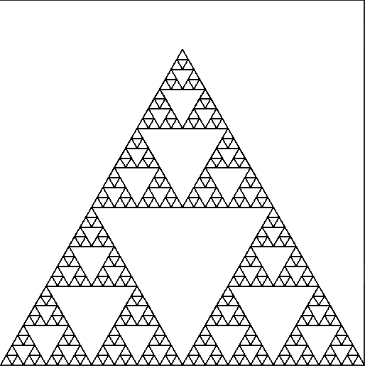
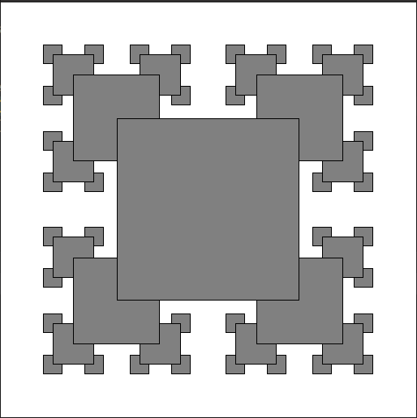
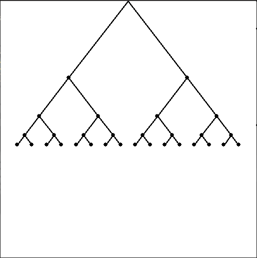

# Fractals with Python
Fractals drawn with Python just for fun :).<br>
I have used stddraw.py (and its dependency color.py) from [this book](https://introcs.cs.princeton.edu/python).

## How to run
Simply choose one of the fractals like <code>triangles.py</code> and enter following command:<br>
```python
python3 triangles.py
```

Here is a preview of each fractal app:

* <code>triangles.py</code> :<br><br>



* <code>squares.py</code> : <br><br>

  
* <code>binary_tree.py</code> :<br><br>
